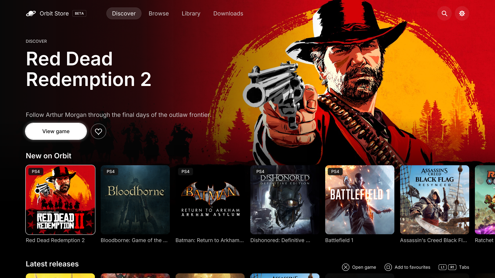
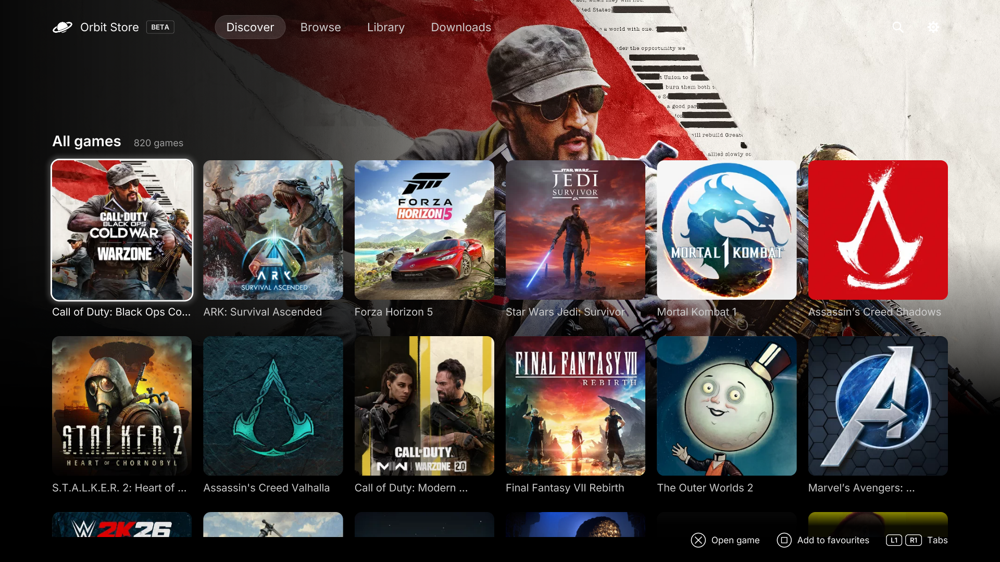
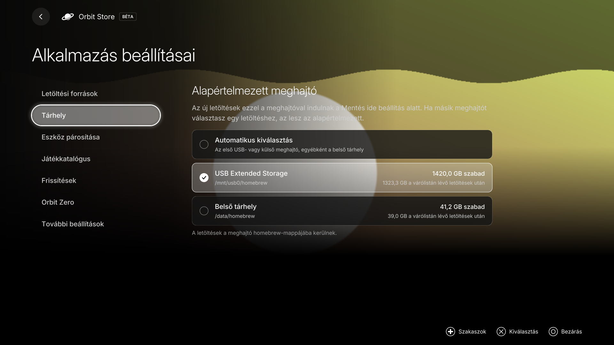
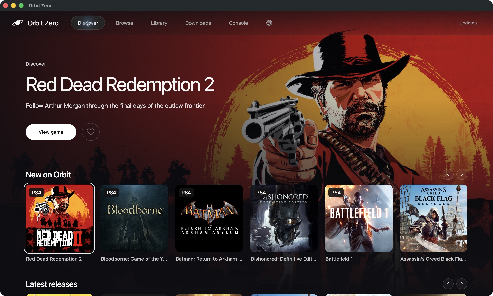
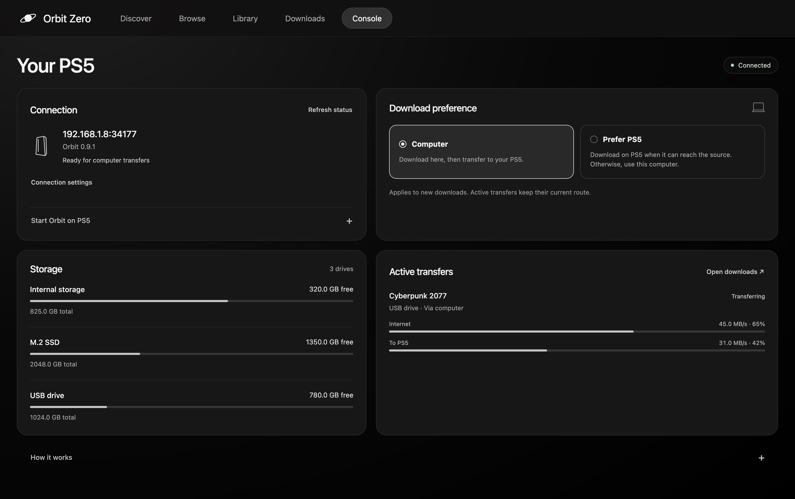

# Orbit Store (Beta)

### A modern, no-BS download manager for PS5.

Orbit runs on your PS5. Browse games, compare their available sources and formats, and download a single file directly to the console or an attached drive. Open the native TV app from your Games row, or pair a phone or computer to manage the same queue over your local network.

Explore **930 games: 730 PS5 games and 200 PS4 games**, with single-file options from Archive.org and Vikingfile. Filter by platform, choose your source and save to your preferred drive. New games and corrected links arrive through catalogue updates.

PS4 game browsing requires **Orbit Store 1.1.0** with its matching native app, or **Orbit Zero 1.1.0**. Orbit itself runs on PS5. See [PS4 games on PS5](guides/downloads.md#ps4-games-on-ps5) for package download and installation guidance.

[Download Orbit](https://github.com/saawant12/orbit-store-ps5/releases/latest) · [Orbit Zero](#orbit-zero-for-mac-windows-and-linux) · [Get started](guides/getting-started.md) · [Download guide](guides/downloads.md) · [Library guide](guides/library.md) · [Troubleshooting](guides/troubleshooting.md) · [Bug report format](.github/ISSUE_TEMPLATE/bug_report.md) · [Report a bug](https://github.com/saawant12/orbit-store-ps5/issues/new?template=bug_report.md) · [Request a feature](https://github.com/saawant12/orbit-store-ps5/issues/new?template=feature_request.md)

> **Official channels:** Orbit Store has no official social media accounts. This GitHub repository is our official source for releases, updates and support. Any social media account claiming to officially represent Orbit Store is an impersonator.

> **Always free.** Orbit Store is free to use and will always remain free. We don’t accept donations or payments. Anyone asking for money on our behalf is not affiliated with the project.

## Built around the console

- **A native app for your TV.** Browse, Discover, Library and Downloads, built for your controller. Your downloads keep running when you close the app.
- **One file per game.** Choose a single-file FFPFSC, exFAT, PKG or FPKG option, with its source, size and version shown before downloading. No archive parts to collect.
- **Your queue, your pace.** Pause, resume, retry and reorder downloads. Check the space they need before adding more.
- **A Library for your drives.** See installed games and available files. Manage compatible sources through ShadowMount.
- **Control from your phone.** Pair once to browse, queue downloads and check progress on the same PS5.
- **Updates when you choose.** Orbit tells you when an update is available. In the TV app, open **App settings → Updates** to manage the TV app and download service separately. Installation, restart and payload-manager setup remain your choice.
- **No Orbit account. No telemetry.** Your paired devices connect to Orbit on your local network. Optional TorBox downloads use your own TorBox account.

## Get started

For direct console downloads, you need a PS5 that can run homebrew ELF payloads, a payload manager or ELF loader, internet access on the console, and enough writable storage. For downloads through your computer, see [Orbit Zero](#orbit-zero-for-mac-windows-and-linux) below.

1. **Choose how to open Orbit.** For the native TV app, download and verify `PPSA99177.ffpkg` from the [latest release](https://github.com/saawant12/orbit-store-ps5/releases/latest), copy it to `/data/homebrew/`, then open Orbit from the Games row. This needs **kstuff and ShadowMountPlus**. For the browser version, run `orbit_store.elf` through your loader and open Orbit from the Media tab.
2. **Choose your sources.** Choose sources in the TV app’s setup screen or **App settings → Download sources**. Select Archive.org, Vikingfile, or both, and acknowledge the download notice. Your choices apply across both versions.
3. **Pick a download.** Open a game and select its main download button to review **Download options**. Choose **Source**, **Download using** and **Save to**, then confirm the download. Direct options download from the TV app. Vikingfile browser options open the provider page on the PS5, keeping your selected game, source and drive. Choose **Open Vikingfile on PS5** in the native app or **Open download page on PS5** in the browser version, press **Download** on Vikingfile, then return to Orbit.
4. **Follow your queue.** Open Downloads on the TV or a paired device to check progress, pause or resume.

The TV app includes Orbit's download service and can start it through a compatible ELF loader on **port 9021**. You can also start `orbit_store.elf` yourself. The Media-tab shortcut opens the browser version while the service is running. After a reboot, start your jailbreak before opening Orbit. See the [setup and update guide](guides/getting-started.md) for installation, updates and phone pairing.

## See how it works

Open Orbit from your Games row and use the controller to browse, explore and choose a download. The native app shares your catalogue, favourites and download queue with the browser version.

*Discover shows the 1.1.0 interface, rendered locally from the native app. Other screenshots show the existing workflows; storage details and download progress are examples.*

### Discover, browse and choose a download

**Start with something new.** Discover opens first. **New on Orbit** brings featured picks and recent additions to the first row, followed by **Latest releases**. Move down to All games to explore a grid of 96 games per page. PS4 and PS5 editions have their own platform labels and download choices.



**Keep exploring.** All games gives each title its own tile. Move through the grid with your controller and use the page controls to see more.



**Find your next game.** Search by name or title ID, narrow the collection by platform, source, format, region or size, and browse the newest known releases first.


**Get to know a game.** Read its description, save it to favourites, or open the three-dot menu for more information. The main download button opens your options before anything starts.


**Choose how and where to download.** Review the source, format, delivery method and drive together. Direct options download from the TV app; Vikingfile browser options open the provider page on PS5 and keep your choices when you return. See the [download guide](guides/downloads.md), including [TorBox setup](guides/downloads.md#optional-download-through-torbox).


### Settings without leaving the TV app

Choose sources, set your default drive, pair a phone and refresh your game catalogue from one place. Updates has separate controls for the TV app and its download service; you choose when to install or restart.


### Orbit in your language

Orbit Store and Orbit Zero support **English, German, Spanish, French, Hungarian, Italian, Dutch, Polish, Brazilian Portuguese, Russian and Turkish**. The native app follows your PS5’s system language. In the browser version, use **App settings → Language** to choose a language for that device, or leave it on **Automatic** to follow the browser.



*Native app 1.3.2 rendered locally in Hungarian. Storage values are illustrative.*

In Orbit Zero, use the globe-shaped **Language** button in the top bar. Language settings change Orbit’s menus; each game keeps its own language settings. See [language settings](guides/getting-started.md#choose-your-language) for instructions and the browser selector.

### The same queue on your phone

Pair a phone on the same network to find a game and choose its download option. Files still go to the PS5’s selected drive. Vikingfile’s provider page and any verification open on the **PS5**, even when you start from your phone.

1. **Find a game.** Search the catalogue and filter the available games.
2. **Compare options.** Check the format, size and destination before downloading.
3. **Start the provider step.** Open Vikingfile on PS5, press Download there, then return to Orbit.

<p>
  <a href="assets/0.9.0/phone-browse.jpg"></a>
  <a href="assets/0.9.0/phone-details.jpg"></a>
  <a href="assets/0.9.0/phone-viking.jpg"></a>
</p>

*Select a screenshot to open it at full size.*

For your existing collection, the [Library guide](guides/library.md) explains installed, mounted and on-drive status, plus the actions available through ShadowMount.

## Orbit Zero for Mac, Windows and Linux

Orbit Zero is our desktop companion for Mac, Windows and Linux. [Download Orbit Zero](https://github.com/saawant12/orbit-store-ps5/releases/latest), open **Console**, enter your PS5’s local IP address and choose **Start Orbit on PS5**.

Download on your computer and transfer to your PS5 at the same time. **Works over your local network: Wi-Fi or Ethernet. Your PS5 does not need internet access.** Keep both devices connected to your home network while the computer handles online downloads.

- **Start Orbit from your computer.** Upload and launch the compatible payload without a separate ELF download or manual file selection. Your PS5 must already have its jailbreak and Payload Manager or an ELF loader running.
- **Control downloads from either device.** Browse and manage the computer’s queue from the desktop or the matching native Orbit app on your PS5.
- **Choose where downloads run.** Use **Computer** to download through your computer, or **Prefer PS5** to download directly when the console can reach the source. Save your preference once.
- **Follow both stages.** See the download and PS5 transfer rates separately, with controls to pause, resume and reconnect.
- **Download more at once.** Download two games to your computer at a time by default, or choose one, two or three in Download settings. PS5 transfers run one at a time while computer downloads continue.

[Install on Mac, Windows or Linux](https://github.com/saawant12/orbit-store-ps5/blob/main/guides/orbit-zero-installation.md) · [Set up a PS5 without internet](https://github.com/saawant12/orbit-store-ps5/blob/main/guides/orbit-zero-offline-ps5.md)

**Download and transfer improvements are included as standard.** It reconnects to your saved PS5 when reopened, lets you choose the computer download folder, and can clear completed computer copies after successful transfers. **Updates** checks for new desktop versions and downloads the correct package when you choose.

### Discover on your computer

Explore PS4 and PS5 games with full artwork, featured picks in New on Orbit and a shared favourites list. Browse’s **Platform** filter lets you choose PS4, PS5 or both. Choose the source and PS5 destination before starting a download.



### Your PS5, at a glance

The Console page brings your connection, available storage, download preference and active transfers together. Pair once using **Show code on PS5**, then manage the connection from your computer.



*Desktop interface previews. Connection, storage and transfer values are illustrative.*

The desktop app supports **ARM64 and x64** computers and the same **11 interface languages** as Orbit Store. Select the globe-shaped **Language** button to choose a language, or **System language** to follow your computer. Keep Orbit Zero and the PS5 awake while transferring; the computer needs internet to fetch new downloads.

## Beta status

**Orbit Store is an experimental beta.** [Download the latest release](https://github.com/saawant12/orbit-store-ps5/releases/latest). Use matching service, TV app and desktop versions for the features described here.

**Introducing Orbit Zero.** Download on your Mac, Windows or Linux computer and transfer to the PS5 over your local network. The PS5 does not need internet. Use the matching 1.1.0 service and native TV app for computer-download controls on the console.

**PS4 and PS5 games in one catalogue.** Explore 920 games with single-file FFPFSC, exFAT, PKG and FPKG options. Compare sources, use TorBox where supported, and choose your destination before downloading. For PS4 packages, follow the [PS4 download guide](guides/downloads.md#ps4-games-on-ps5). Installation and launching are separate.

**A refreshed interface on TV and in the browser.** Explore New on Orbit and Latest releases, filter Browse by platform, format or region, and review your download choices in one panel. Orbit also improves M.2 storage detection and makes it easier to delete cancelled downloads and start fresh. Keep the PS5 awake while downloading.

**Payload-manager setup is opt-in.** Choose **App settings → Payload managers → Add Orbit** to let Orbit add and update a copy. Existing copies stay in place until you choose whether to allow updates. Auto-start is a separate choice, and Orbit leaves your manager's global Autoload switch unchanged.

Compatibility varies by PS5 firmware, loader and ShadowMount version. Library requires a compatible ShadowMount v1 local API, and available actions depend on your setup. If something goes wrong, use the [bug report format](.github/ISSUE_TEMPLATE/bug_report.md) and include your versions and the error shown. The reported etaHEN payload-toggle issue remains under investigation.

Downloads are single-file **FFPFSC**, **exFAT**, **PKG** and **FPKG** options across **Archive.org** and **Vikingfile**. The available sources and formats depend on the game. Availability and compatibility can vary between files and providers.

PS4 games require Orbit Store 1.1.0 with its matching TV app, or Orbit Zero 1.1.0. Earlier supported apps continue to receive their PS5-compatible catalogue; a catalogue refresh alone does not add PS4 support to an older app. You only need an Orbit app update for new features and fixes. Your queued downloads keep the files you originally chose.

## Using the beta

The [release downloads](https://github.com/saawant12/orbit-store-ps5/releases/latest) include:

- Orbit Zero for Mac, Windows and Linux, in ARM64 and x64 builds. Follow the [desktop installation guide](guides/orbit-zero-installation.md).

- [PPSA99177.ffpkg](https://github.com/saawant12/orbit-store-ps5/releases/latest/download/PPSA99177.ffpkg), the native TV app, and [its checksum](https://github.com/saawant12/orbit-store-ps5/releases/latest/download/PPSA99177.ffpkg.sha256).
- [orbit_store.elf](https://github.com/saawant12/orbit-store-ps5/releases/latest/download/orbit_store.elf), the download service and browser interface, and [its checksum](https://github.com/saawant12/orbit-store-ps5/releases/latest/download/orbit_store.elf.sha256).
- The complete source and licence bundle for the PS5 service, browser interface, native TV app and their open-source components, with build instructions.

Put each download beside its `.sha256` file and run `shasum -a 256 -c <filename>.sha256`. To install the TV app from Orbit 0.6.0 or later, use **App settings → TV app** in the browser version. See the [installation guide](guides/getting-started.md) for both options.

To download Orbit through **Payload Manager**, open **Settings → Manage Sources → Add Source** and paste:

```text
https://raw.githubusercontent.com/saawant12/orbit-store-ps5/main/payloads.json
```

Open the **Orbit Store** source, download **Orbit Store (Beta)**, then run `orbit_store.elf`. The feed includes its version and SHA-256 checksum using the [Payload Manager repository format](https://github.com/itsPLK/ps5-payload-manager/blob/main/CUSTOM_REPOSITORIES.md).

For the browser version, the setup and everyday workflow is:

1. **Run it once.** Run `orbit_store.elf` through your payload manager or ELF loader. Orbit starts, saves itself on the console, and adds the **Orbit Store** home-screen icon.
2. **Choose manager setup.** Optionally open **App settings → Payload managers → Add Orbit** for Payload Manager or Homebrew Launcher. This adds a copy and lets Orbit keep it current. Auto-start is separate: use **Start automatically**, then enable the global Autoload switch yourself in Payload Manager if needed. Existing `autoload.txt` lists are supported; etaHEN setup is manual in its Toolbox.
3. **Open the icon.** Once Orbit is running, select its home-screen icon to open the storefront.
4. **Choose your sources.** Sources start off. Select Archive.org, Vikingfile, or both, read the notice, and acknowledge your responsibility to download only content you are legally entitled to access and use.
5. **Download on the console.** Open a game and select its main download button. In **Download options**, choose **Source**, **Download using** and **Save to**, then select **Download to PS5** for a direct option. For a Vikingfile browser option, select **Open download page on PS5**, complete any verification and press Download on Vikingfile, then return to Orbit and open Downloads. Orbit checks the file before adding it to the queue.
6. **Use your phone if you want.** While Orbit is running, visit `http://<ps5-ip>:34177/` on the same network and select **Pair devices**. Enter the console's six-digit code. Choose **Show code on PS5** if you missed the notification, or open **Pair devices** on the console to keep the code visible until you close it.

After a reboot, run your jailbreak as usual. Open the Games-row TV app to start Orbit through your ELF loader, or start the payload manually or through auto-start you have configured. The Media-tab browser shortcut needs Orbit already running. If auto-start does not launch Orbit on your setup, start it manually from your payload manager.

Keep the PS5 awake while downloading. Closing the storefront leaves downloads running. After an Orbit restart, interrupted transfers become paused so you can review and resume them.

## Updating or reinstalling Orbit

**Update the service and TV app separately.** In the native app, open **App settings → Updates** for both. In the browser version, **App settings → Update / reinstall** updates the ELF; **App settings → TV app** installs or updates the native app. Close the TV app before replacing it. If ShadowMountPlus still opens the old version, restart the console when convenient and run your jailbreak again. Replacing the FFPKG does not switch an already-running Orbit service; stop Orbit deliberately before starting its new copy. The [update guide](guides/getting-started.md#update-the-tv-app) explains both steps.

**After upgrading to 0.4.2, use 0.4.2 or newer.** The saved download queue uses a newer format that older versions cannot read.

**Coming from beta.2 or earlier:** download the new ELF and replace the existing `orbit_store.elf` in Payload Manager. Accept its overwrite/reinstall prompt. Pause downloads, stop only the identifiable Orbit process in Payload Manager’s **Active Processes**, then run the new ELF. If you cannot confidently identify the process, restart the console when convenient, run the jailbreak and launch the new ELF. Keep the Orbit icon and its saved data.

To restore a deleted Orbit icon, start Orbit through your payload manager. Your paired devices, source choices and download queue stay saved.

Loading an ELF while Orbit is already running saves the replacement for the next start. It does not switch the active session. The notification now explains this; an existing icon is expected and does not need to be removed.

**From beta.3 onward:**

1. Open **App settings → Update / reinstall → Check for updates**.
2. Choose **Install update**, or **Reinstall release** for the current published version. Orbit downloads the official ELF and verifies its SHA-256 checksum before replacing the saved copy.
3. When **Restart needed** appears, select **Stop Orbit to restart** and confirm. Your queue is saved and paused; other payloads keep running.
4. Run `/data/orbit-store/orbit_store.elf`, or a manager copy you opted to keep in sync, and reopen Orbit. Review and resume your downloads.

**Stop syncing** preserves the existing manager copy and its auto-start settings, but stops updating that copy. If you prefer to keep a manually imported ELF outside sync, replace it yourself when updating or launch the saved path above. Running an old imported ELF starts that older version.

The panel shows **Running**, **Saved for next start**, and **Latest release** separately. Pairing, source choices and the download queue are preserved. Updates are manual; no release is installed just by opening the panel. If a download or copy fails, Orbit reports the error and leaves the running session open for a retry.

After using TorBox, keep using Orbit 0.8.0 or later while those jobs remain in your queue or history. Earlier releases cannot read TorBox jobs. Update both the service and TV app to use all new controls.

## Managing your downloads

New large downloads use up to eight connections when the host supports byte ranges and a strong file identity. Existing partials keep their original layout; other downloads use one connection. Pause, Resume and Cancel apply to the entire download. Speed depends on the host, network and storage.

Open **Downloads** and choose **Active**, **Finished**, **Failed** or **Cancelled**. Finished contains only successfully completed downloads; cancelled items have their own view. Move waiting downloads up or down to choose what runs next. Paused items keep their place. A retry countdown tells you when Orbit will try an interrupted download again.

**Remove from history**, **Clear finished history** and **Clear cancelled history** keep downloaded files on your drive. Each clear button affects only its own view. A cancelled download with a kept partial file stays listed so you can resume it. To remove it, reconnect its original drive, choose **Partial file options → Delete partial file**, then remove the history entry.

Before queuing a game, check **Free now**, **Unfinished downloads** and **After queue + this download**. Paused and failed downloads count toward the estimate; cancelled ones do not. Other apps can change free space, so Orbit checks again when a download starts.

## Your Library

Open **Library** to see installed games and game files reported on your drives, including their mount and availability status. Search by name, title ID or path and filter by status, location or format. Library works independently of your download-source choices.

Run a compatible **ShadowMount with its v1 local HTTP API enabled** on the same PS5. Orbit reads that local inventory and shows the actions your ShadowMount version supports. It does not start ShadowMount or change its configuration.

- **Refresh** updates the view. **Scan for games** asks ShadowMount to discover sources and may register or mount them after confirmation.
- Open a game to **mount or unmount** its compatible source. Orbit does not launch games or uninstall them.
- **Copy** keeps the original; **Move** asks ShadowMount to remove it after a successful transfer. Unmount the source first, select the destination and confirm. Pause active and queued Orbit downloads before starting.
- Open **Storage** to check drive capacity and request game sizes. Follow copy/move progress and cancel while ShadowMount reports it is safe. A storage job can continue if Orbit stops.

If ShadowMount is absent or its API is incompatible, Library explains what is missing. A disconnected source stays distinguishable from an available one; refreshing does not delete files.

## Finding and saving games

In **Browse**, combine platform, source, format, region and download-size filters, then choose a sort order. Size sorting uses the smallest option matching your filters. **Release date (newest first)** is the default. Games without a recorded date appear afterward, alphabetically. **Reset filters** restores this order.

Open a game's details and choose **Add to favourites**, or press **Square** on a selected game in native Browse or Discover. Your favourites are shared between the console and paired devices and stay saved after restarting Orbit. Disabling a source hides its games without forgetting your favourites.

## Refreshing the game catalogue

New games appear automatically, without reinstalling or restarting Orbit. To check for additions yourself, open **App settings → Game catalogue → Refresh catalogue**. Orbit also checks when it starts and every six hours while running.

If your connection drops, you can still browse the last available catalogue. Reconnect to download games or get the latest additions. Your source choices and queued downloads stay as you left them.

## Controls and formats

In the native TV app, use the D-pad or left stick to move, Cross to select, Circle to go back, and L1/R1 to switch tabs. Filters open with Cross; choose with the D-pad and Cross, or close with Circle. The table below applies to the browser version.

| Control | Action |
|---|---|
| D-pad / arrow keys | Move focus |
| Cross / Enter | Select |
| Search: Up / Down | Return to the Browse tab / move to results; with no matches, Down reaches collection controls |
| Search: Left / Right | Move the text cursor |
| Circle / Escape | Back or close details |
| Touch / mouse | Select visible controls |

The catalogue offers single-file **FFPFSC**, **exFAT**, **PKG** and **FPKG** options across Archive.org and Vikingfile.

Source choices are saved on the console and shared by paired devices. Turning off a source hides its download options and pauses unfinished downloads without deleting files. A game stays visible if another enabled source offers it. Re-enable a source and resume its downloads when ready. There is no user library import or custom source entry in this version.

Orbit does **not** extract RAR/7z archives, directly install game packages, launch games, or download in rest mode. Library actions use ShadowMount; a confirmed scan may register or mount discovered games. “Complete” means the file was saved and passed available validation. Size-only checks are labelled separately from checksum verification.

## When something needs attention

When reporting a bug, follow the [bug report format](.github/ISSUE_TEMPLATE/bug_report.md) and [open a bug report](https://github.com/saawant12/orbit-store-ps5/issues/new?template=bug_report.md). Include your setup, the exact error and a diagnostic report when available, and complete the sections relevant to your issue.

- **No storage:** if internal storage or your M.2 SSD disappeared in 0.9.0, update to the latest release, restart Orbit and refresh storage. For external drives, check that the drive is connected to the PS5. A drive connected to your computer is not PS5 storage.
- **Drive disconnected:** reconnect the original destination. Orbit will not silently switch to internal storage.
- **Not enough space:** free space on the selected destination before retrying.
- **Source changed:** preserve the partial file until you decide to remove it and restart. Orbit will not append a different file to it.
- **“Provider returned a page” on an older version:** update to the latest release, restart Orbit, then open **Downloads → Failed → Retry download**. Existing partial files are checked before resuming. If the provider actually returns an error page, Orbit will still reject it.
- **Provider throttling:** let the retry delay finish. Orbit respects the provider's `Retry-After` response.
- **Icon does not open Orbit:** start Orbit through Payload Manager, then open the icon again.
- **Cannot connect:** check that the payload is running and your device is on the same local network. Orbit uses TCP port **34177**.
- **Missed the pairing code:** select **Pair devices**. The PS5 keeps the code on screen; phones and computers can request the notification again every 30 seconds.
- **Port already in use:** Orbit reports the port in its startup error. Check which service is using it before retrying.

## Licence

Orbit Store is free software under the GNU General Public License, version 3 or later. Every release includes the complete source for its payload and native TV app, the corresponding sources of their copyleft components, third-party licence notices and rebuild instructions.

---

## IMPORTANT: THIRD-PARTY CONTENT & DOWNLOAD DISCLAIMER

**Orbit Store is an independent download-management application. This project does not host, upload, mirror, or bundle the game files referenced by its catalogue.** File transfers happen directly between third-party providers and the user's selected device. This repository hosts Orbit's documentation and, when released, Orbit's own application files.

Catalogue entries reference publicly accessible third-party URLs. **Publicly accessible does not mean authorised, licensed, or free to redistribute.** Use Orbit only for material you have permission to obtain and use, in accordance with applicable law, relevant licences, and the provider's terms. Owning a game does not, by itself, establish permission to obtain any copy found online.

**Third-party files are outside this project's control.** Their hosts and uploaders control availability and contents. Orbit does not guarantee ownership, authenticity, completeness, safety, compatibility, or continued availability. Download completion, a matching file size, or a matching checksum is a technical result, not a licence or a guarantee that the file is safe to run.

All game names, artwork, trademarks, and other third-party materials belong to their respective owners. Orbit is **not affiliated with or endorsed by** Sony Interactive Entertainment, PlayStation, game publishers, or download providers. The app does not supply accounts, credentials, purchase entitlements, or permission to bypass access restrictions.

To report an incorrect entry or a rights concern, open an issue with the affected title, URL, and sufficient information to identify the concern. Do not post private personal information. The underlying hosting provider is responsible for files it hosts; Orbit's maintainers can review catalogue references controlled by this project.
