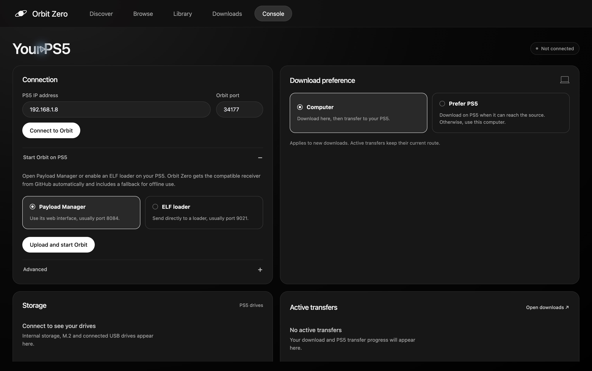
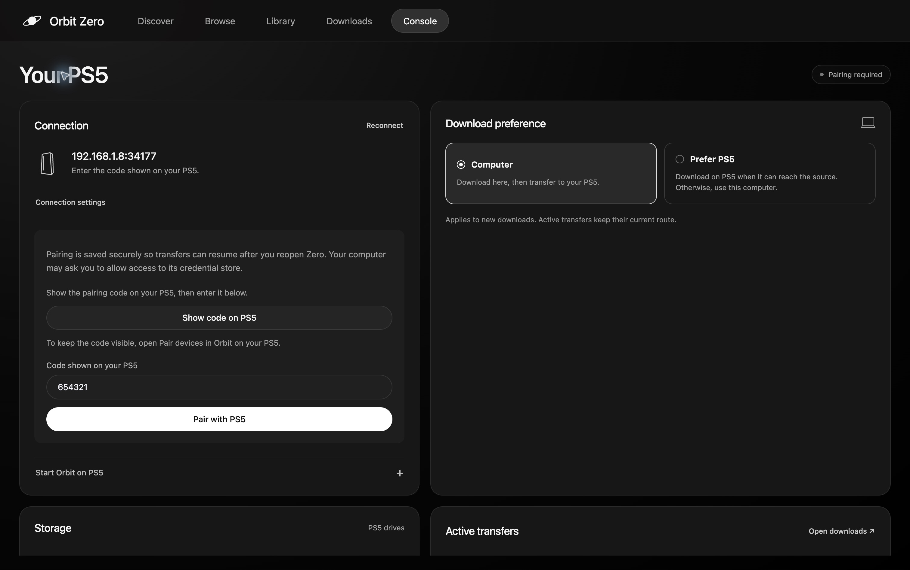
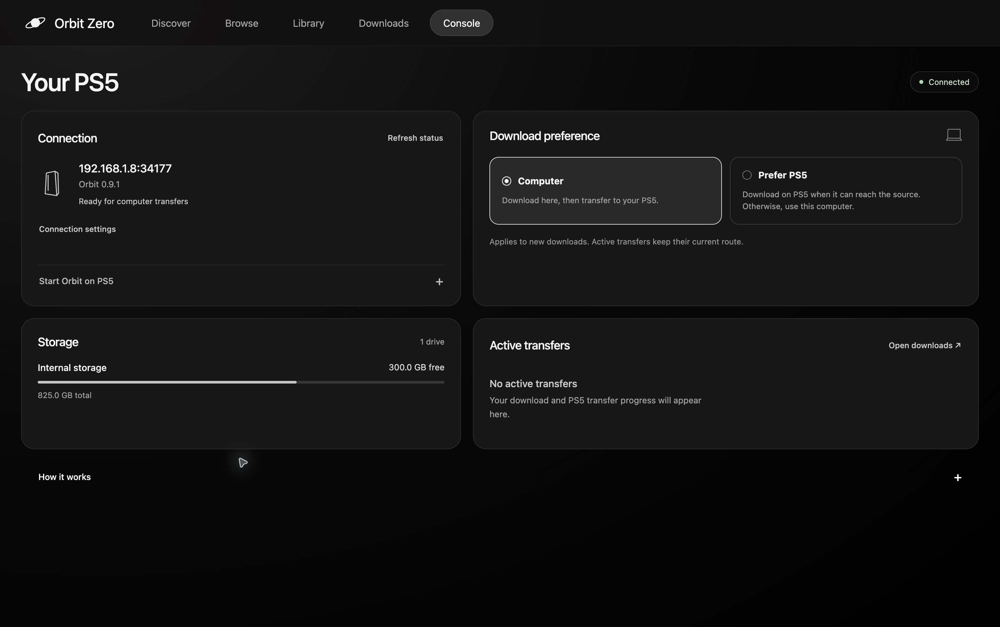

# Set up Orbit on a PS5 without internet

Install **Orbit Zero on your computer**, then use it to upload and start Orbit on your PS5 over your local network. Your computer handles online downloads and sends the files to the console. **The PS5 can keep its internet access blocked throughout setup and use.**

This guide covers **Orbit Zero 1.0.5** and the matching PS5 files from the [Orbit Store release](https://github.com/saawant12/orbit-store-ps5/releases/tag/v1.0.5).

The desktop app includes the compatible Orbit service and uploads it over your local network. If an older Orbit service is already running, stop it before starting the new copy. See the [download choices and update steps](orbit-zero-installation.md).

## What you need

- A Mac, Windows or Linux computer with Orbit Zero installed. Follow the [desktop installation guide](orbit-zero-installation.md) for your operating system.
- A PS5 with its jailbreak and **Payload Manager or an ELF loader already running**. Use your existing offline-compatible setup; Orbit Zero does not jailbreak the console or install its loader.
- Both devices connected to the same reachable local network: **Wi-Fi or Ethernet**, including a mixture of the two.
- Enough free space on the computer for the full download and on the PS5 destination drive.

Your **computer needs internet access to fetch new downloads**. Your PS5 only needs access to the computer over the local network. You do not need to download an ELF separately: Orbit Zero includes a compatible copy and can check GitHub for a compatible update from the computer.

## 1. Keep the PS5 connected locally

Leave the PS5 connected to your router by Wi-Fi or Ethernet. Keep your existing internet-blocking setup in place, provided it allows devices on your home network to reach each other.

**Do not disconnect the PS5 from Wi-Fi or unplug its network cable.** Blocking internet access and disconnecting from the local network are different things. Avoid guest Wi-Fi or client isolation that prevents the computer and PS5 from communicating.

Find the PS5's current local IPv4 address in its network settings. You will enter this address in Orbit Zero. An internet connection test can fail while the local connection still works.

Allow Orbit Zero through your computer's local-network or firewall prompt. See the [Mac](orbit-zero-installation.md#macos), [Windows](orbit-zero-installation.md#windows) or [Linux](orbit-zero-installation.md#ubuntu-and-debian) instructions if needed. There is no need to expose ports to the internet or configure router port forwarding.

## 2. Upload and start Orbit from the computer

1. Start your PS5's jailbreak and **Payload Manager** or ELF loader.
2. Open Orbit Zero on the computer and go to **Console**.
3. Enter your **PS5's local IP address**. Leave **Orbit port** at **34177**, unless you changed it.
4. Under **Start Orbit on PS5**, choose the method your console is running:

   | Running on your PS5 | Choose in Orbit Zero | Usual port |
   | --- | --- | --- |
   | Payload Manager with a web interface | **Payload Manager → Upload and start Orbit** | **8084** |
   | A raw ELF loader | **ELF loader → Send to ELF loader** | **9021** |

5. Wait for the upload and startup to finish. **Orbit Zero connects automatically afterward.**

*The screenshots show the setup flow with illustrative connection and storage values. Use your own console address and pairing code.*

Everything sent to the PS5 in this step travels over your local network. The console does not visit GitHub or a download provider. You do not need to find or select an ELF manually.

If you need to select the ELF yourself, follow the [manual GitHub download and upload steps](orbit-zero-installation.md#manual-fallback-download-the-elf-yourself). Download the file on your computer; the PS5 can stay offline.

If Payload Manager opens at `http://<ps5-ip>:8084/`, choose **Payload Manager**. Its web interface is separate from an ELF loader on port 9021. Use **Advanced** if your loader uses a different port.

If Orbit is already running, select **Connect to Orbit**. When replacing an older running service, stop it through Orbit's **App settings → Update / reinstall → Stop Orbit to restart** before starting the new copy; uploading an ELF alone does not replace the running session.

## 3. Pair the computer and PS5

1. When Orbit Zero shows **Pairing required**, select **Show code on PS5**.
2. Read the six-digit code in the PS5 notification.
3. Enter it in Orbit Zero and select **Pair with PS5**.
4. If your computer asks to unlock its credential store, allow Orbit Zero to save the pairing. Enter any computer password only in the operating system's prompt.

If you miss the notification, request the code again after the countdown. Pairing takes place locally and does not require internet on the PS5.

## 4. Download through the computer

Once **Connected** appears, check that the intended PS5 drive is listed under **Storage**. Set **Console → Download preference → Computer**.

Open a game in Orbit Zero, choose its source and PS5 destination, then start the download. The computer downloads the file and transfers completed parts to the PS5 while the download continues.

**Downloads** shows both stages separately:

- **Download to computer:** progress and speed from the online provider.
- **Transfer to PS5:** progress and speed across your local network.

For Vikingfile, complete any verification and select the file's Download button in the provider window **on the computer**. Orbit Zero captures the file link and queues the download; the PS5 does not need to open Vikingfile.

Keep **both devices awake** and Orbit Zero open until the transfer finishes. By default, completed downloads remain in the computer cache. In **Downloads → Download settings → Computer cache**, enable **Automatically remove after transfer** for future successful transfers, or use **Clear completed cache** to remove existing completed copies. The finished PS5 files stay in place.

The **Computer** preference chooses where downloads run; it does not change your router or block the PS5's internet access for you.

## Optional: use Orbit's native app on the PS5

You can manage everything from the desktop without installing the native app. To browse and control the computer's downloads from your TV, install the **matching `PPSA99177.ffpkg`** locally:

1. On your **computer**, get `PPSA99177.ffpkg` and its checksum from the same Orbit Store release as your Zero build. Verify the checksum as described in the [native app guide](getting-started.md#install-the-native-tv-app).
2. Keep **kstuff and ShadowMountPlus** running on the console. Close any open native Orbit app before replacing its file.
3. Enable your PS5's FTP server. Connect to it from an FTP client on the computer using the **local IP address and port shown by the server**.
4. Copy `PPSA99177.ffpkg` to **`/data/homebrew/`** on the PS5. This is a local file transfer; the PS5 does not download the package from the internet.
5. Let ShadowMountPlus register it, then open **Orbit Store** from the **Games row**. Keep the Orbit service you started from Orbit Zero running.
6. In the native app, select **App settings → Orbit Zero → Enable Orbit Zero**. Pair the computer first if the app says no computer is paired.

The native app now uses your computer's catalogue and artwork. New downloads follow the **Computer** preference set above. Keep Orbit Zero running on the computer; Vikingfile verification is completed there too.

For an existing installation, replace its matching FFPKG rather than keeping multiple app copies. Keep `/data/orbit-store/`, which contains Orbit's settings and queue. See [updating the native app](getting-started.md#update-the-tv-app) for folder installations and registration troubleshooting. For an internet-blocked PS5, use this computer-to-console file transfer when updating, rather than the console's online updater.

### Browser controls on the PS5

After desktop pairing, expand **Console → How it works** in Orbit Zero. Open one of the displayed **computer addresses** in the PS5 browser and enter the pairing code shown in that section.

This is a local page served by the computer, normally on port **34179**. Its code is separate from the PS5 notification code used in step 3. Keep the computer and Orbit Zero running while using it. Use this displayed computer address for Zero's browser controls; the ordinary Orbit Media-tab shortcut opens the console's own interface.

## Next time you use it

1. After a PS5 reboot, run your jailbreak and start Payload Manager or your ELF loader again.
2. Open Orbit Zero. If Orbit is not running on the console, use **Start Orbit on PS5**. Zero reconnects automatically when the saved console is reachable; otherwise, select **Reconnect**.
3. Your saved pairing is reused when valid. Resume any paused or interrupted downloads explicitly.

You do not need to reinstall the native FFPKG each time. Keep the original pairing when resuming unfinished transfers.

## Troubleshooting

| What you see | What to check |
| --- | --- |
| The PS5 says it has no internet | That is expected with internet blocked. Check whether Orbit Zero can reach its local IP address. |
| Payload Manager works, but no loader is listening on 9021 | Choose **Payload Manager** and its web port, usually **8084**. |
| Orbit cannot be reached on 34177 | Start the Orbit payload, confirm the PS5's current IP, and allow local-network access on the computer. |
| Upload finished, but pairing did not appear | Give Orbit time to start, then select **Connect to Orbit**. Check the PS5 notification before sending another launch request. |
| No pairing code appeared | Select **Show code on PS5** and watch the console notification. |
| The native app cannot find the computer | Keep Zero open, pair it first, enable **App settings → Orbit Zero**, and check the computer firewall allows local access. |
| A transfer stopped after sleep or disconnection | Wake both devices, reconnect the same console and select **Resume**. |

Return to the [desktop installation guide](orbit-zero-installation.md) for OS-specific setup and permissions.
