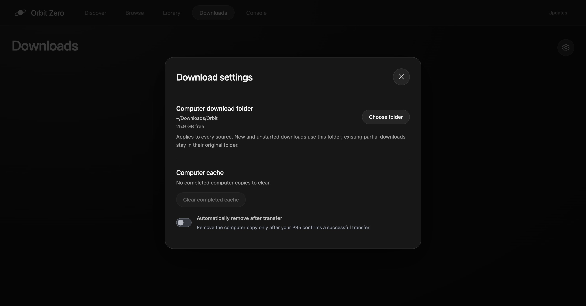
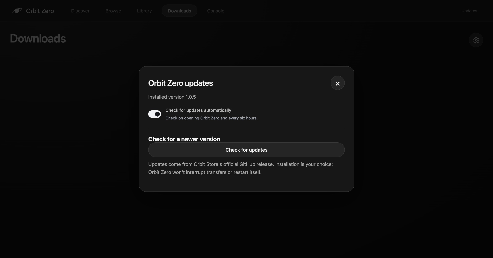

# Orbit Zero

Orbit Zero downloads on your computer and transfers the file to your PS5 over the local network. The two stages overlap: completed chunks can reach the console while the computer is still downloading. Use the desktop app, a compatible native Orbit TV app, or the local browser controls to browse and manage the queue.

Download the desktop app and matching PS5 files from [Orbit Store releases](https://github.com/saawant12/orbit-store-ps5/releases/latest). PS4 browsing and desktop language selection require Orbit Zero 1.1.0. For a console without internet, follow the [offline PS5 setup guide](orbit-zero-offline-ps5.md).

**Download and transfer improvements are included as standard.** Follow the [installation and update steps](orbit-zero-installation.md) to update the desktop app and PS5 service together.

The full-screen screenshots show the desktop interface. Connection, storage and transfer values are illustrative.

*Discover in Orbit Zero.*

## What you need

- A computer with internet access and enough free space to cache the full download, plus writable storage on the PS5.
- A PS5 with its jailbreak and Payload Manager or a compatible ELF loader already running, or the matching Orbit receiver already started. Zero does not jailbreak the console.
- Both devices on the same reachable home network. Wi-Fi, Ethernet, or a mixture of both work. Use the PS5's local IPv4 address.
- Orbit Zero and its included Orbit Store 1.1.0 service. For native TV controls, install the matching FFPKG from the same release.

Downloads are available for **ARM64 and x64 on macOS, Windows and Linux**; 32-bit x86 is not supported. Mac builds use Developer ID signing but are not notarized; Windows and Linux packages are unsigned. The interface supports English, German, Spanish, French, Hungarian, Italian, Dutch, Polish, Brazilian Portuguese, Russian and Turkish. Select the globe-shaped **Language** button to choose one, or leave **System language** selected.

## Install Orbit Zero

Follow the [macOS, Windows and Linux installation guide](orbit-zero-installation.md). It covers the right download for your computer, installation, first-launch permissions and updating an existing copy.

## Connect the computer and console

1. Start the PS5's jailbreak and Payload Manager or ELF loader. Open **Console** in Zero and enter the PS5's local IP address.
2. Expand **Start Orbit on PS5**. For Payload Manager's web interface, choose **Payload Manager → Upload and start Orbit**. This saves or replaces `orbit_store.elf` in the manager and leaves autoload settings unchanged. For a separate raw loader, choose **ELF loader → Send to ELF loader**. Zero checks the official GitHub payload feed for a compatible receiver, verifies its checksum and caches it. The app also includes a verified compatible receiver for offline setup. If the matching receiver is already running, use **Connect to Orbit** instead. Do not start another Orbit service on the same port.
3. Zero connects automatically after uploading Orbit. Once connected, select **Show code on PS5**. Enter the six-digit code shown by the console and select **Pair with PS5**. You can request the notification again after the countdown, or open **Pair devices** in Orbit on the PS5 to keep its code visible.
4. Open a game and choose its source and PS5 destination in the download sheet. The destination is selected for each download; the Console overview shows current storage capacity. Game details also offers **Favourite**, **About this game** and **View download** when that game is already in the queue.

*Game details in Orbit Zero.*

*Download options in Orbit Zero, with simulated destination capacity.*

The normal Orbit service port is **34177**. Payload Manager's web interface defaults to **8084**, while the raw ELF loader defaults to **9021**. These use different protocols: changing the port alone does not switch between them. Choose the matching method, then use **Start Orbit on PS5 → Advanced** if its port is different. Manual ELF selection is there too; a custom ELF sent through Payload Manager is saved as `orbit_zero_custom.elf`.

On macOS, allow Orbit Zero to access the local network when prompted. If access was denied, enable it in **System Settings → Privacy & Security → Local Network**, then reconnect.

Pairing is saved using the computer's encrypted credential store. Zero reconnects to your saved PS5 when you reopen it; macOS or Linux may ask to unlock saved pairing after the console responds. If reconnection fails, select **Console → Reconnect**. Zero never receives your computer password, and refuses to save an unencrypted pairing if secure storage is unavailable. Keep the original pairing to resume unfinished transfers.

*Console in Orbit Zero. Connection, storage and transfer values are simulated.*

## Browse PS4 and PS5 games

**New on Orbit** appears first in Discover, followed by **Latest releases** and the All games grid. In Browse, use **Platform** to choose PS4, PS5 or both. Platform editions stay separate, with their own images, release dates and download options.

The 1.1.0 catalogue includes 100 PS4 games as single-file PKG/FPKG downloads. Choose a source and PS5 destination just as you would for a PS5 game. The computer-download route also works with the PS5’s internet access blocked. Completed packages need the installation method supported by your PS5 setup; Zero does not install them. See [PS4 games on PS5](downloads.md#ps4-games-on-ps5).

## Choose where downloads run

| Preference | New downloads |
| --- | --- |
| **Computer** (default) | Download through the computer and transfer completed chunks to the PS5. |
| **Prefer PS5** | Check whether the PS5 can reach the selected source, then use a direct PS5 download if it can. Otherwise, use the computer. |

Change this under **Console → Download preference**. It applies to new downloads; running downloads keep their original route. The PS5 needs internet access for direct PS5 downloads. For computer downloads, the computer handles provider access and artwork, so the PS5 only needs its local network connection.

Zero downloads two games to the computer at a time by default. Open **Downloads → Download settings → Simultaneous computer downloads** to choose **1**, **2** or **3**. Lowering the limit lets current downloads finish before another starts. Files transfer to the PS5 one at a time while computer downloads continue. Each file needs enough computer space for its full cached copy.

Each computer download uses up to eight connections when the provider supports validated byte ranges, with a single-connection fallback. Actual speed depends on the provider, network and storage. **Downloads** shows **Download to computer** and **Transfer to PS5** separately; their rates and progress can differ. A direct PS5 download shows the rate reported by Orbit.

*Downloads in Orbit Zero. Progress and rates illustrate the two stages; they are not measured transfer results.*

For Vikingfile, Zero opens a separate browser window on the computer. Complete any provider verification and select the matching file's Download button. Zero captures and checks the final file link before adding it to the queue. Provider logins stay in a separate persistent browser profile on the computer. Unwanted popups are blocked; **Back**, **Reload** and **Return to download page** let you get back to the file.

## Control it from the PS5

After pairing the computer, open **App settings → Orbit Zero → Enable Orbit Zero** in the matching TV app. It uses the computer's catalogue and artwork, and new downloads follow the preference saved on the computer. Vikingfile verification asks you to continue on the computer. Turning Zero mode off affects new downloads; existing computer transfers keep their route.

Alternatively, expand **Console → How it works** in the desktop app. Open one of the displayed computer addresses in the PS5 browser and enter the computer's pairing code. This browser pairing code is separate from the console code used to pair the desktop. Keep it private. The desktop's local browser service normally uses port **34179**.

## Choose the computer download folder

In Console, select **Computer download folder → Choose folder**. In Downloads, open the settings icon beside the page title to find the same control. This applies to every source. New downloads use the folder you choose; existing partial files stay in their original location so they can resume.

## Pause, reconnect and clean up

Keep Orbit Zero open and prevent the computer from sleeping during transfers. Keep the PS5 awake to receive files. If the console disconnects after a transfer starts, the computer can continue downloading into its cache. Reconnect the original console and select **Resume**. Paused or interrupted downloads need an explicit resume after restarting Zero.

**Waiting to transfer** means the computer copy is ready for its PS5 turn. If an earlier PS5 transfer is paused or needs attention, resume it, cancel and remove its partials, or choose **Stop transfer** to keep its files and release that turn. Other computer downloads can continue in the meantime.

The computer copy is kept by default. **Downloads → Download settings → Computer cache** offers **Automatically remove after transfer** for future successful transfers and **Clear completed cache** for copies already completed. You can still select **Remove computer cache** on an individual download. Cleanup preserves PS5 files, partial downloads and history. **Cancel and remove partials** asks for confirmation before deleting the transfer's partial files. Cancelled computer downloads offer **Remove from history**, which removes only the queue entry and keeps files.

*Download settings in Orbit Zero 1.0.5. The folder and free space shown are illustrative.*

To forget the console, use **Console → Connection settings → Unpair PS5**. Finish or cancel unfinished computer transfers first, including paused or interrupted transfers, because they require the original pairing to resume. Unpairing keeps files and download history.

Library is read-only in the first desktop version. Zero transfers files; it does not install or launch games.

## Desktop updates

Open **Updates** in the top navigation. Automatic checks are enabled by default. When an update is available, download the matching verified package and open it when ready to install. Orbit Zero does not replace itself or restart automatically. See [update steps](orbit-zero-installation.md#update-checks-in-orbit-zero).

Return to the [Orbit Store README](../README.md) for the current release, supported PS5 workflows and third-party content notice.
